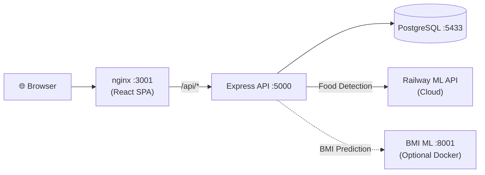

# 🏠 Habitscape — Full Stack

Habitscape is a health & nutrition tracking platform featuring AI-powered food detection, BMI analysis, and lifestyle recommendations.

## Architecture



| Service | Stack | Local URL |
|---------|-------|-----------|
| Frontend | React + Vite + nginx | http://localhost:3001 |
| Backend | Express.js + PostgreSQL | http://localhost:5000 |
| PostgreSQL | Postgres 16 Alpine | localhost:5433 |
| Food Detection ML | FastAPI + YOLO (Railway) | https://habitscape-production.up.railway.app |
| BMI ML (optional) | FastAPI + TensorFlow | http://localhost:8001 |

---

## 🚀 Quick Start with Docker

### Prerequisites

- [Docker Desktop](https://www.docker.com/products/docker-desktop/) with Docker Compose v2
- The workspace must have this layout:

```
Capstone/
├── Full Stack/          ← you are here
│   ├── backend/
│   ├── frontend/
│   ├── docker-compose.yml
│   └── .env             ← create from .env.example
└── ML/
    └── Habitscape/
        └── bmi-classification/   ← only needed with --profile ml
```

### 1. Configure environment

```bash
# From the "Full Stack" directory:
cp .env.example .env
```

Edit `.env` and set your secrets (at minimum, change `JWT_SECRET` for production).

### 2. Build & run

```bash
# Start core services (frontend + backend + postgres)
docker compose up --build

# Or include the BMI ML service:
docker compose --profile ml up --build
```

### 3. Open the app

| What | URL |
|------|-----|
| **App (Frontend)** | http://localhost:3001 |
| **API Health Check** | http://localhost:3001/api/v1/health |
| **Swagger API Docs** | http://localhost:3001/docs |
| **Backend Direct** | http://localhost:5000/api/v1/health |
| **BMI ML Swagger** (if `--profile ml`) | http://localhost:8001/docs |

### 4. Stop services

```bash
docker compose down           # stop containers
docker compose down -v        # stop + delete database volumes
```

---

## 🖥️ Manual Run (Without Docker)

### Backend

```bash
cd backend
npm install
cp .env.example .env          # edit with your DB credentials
npm run db:init                # create tables in PostgreSQL
npm run dev                    # start with nodemon (hot reload)
```

The backend requires a running PostgreSQL instance. Update `DATABASE_URL` in `backend/.env`.

### Frontend

```bash
cd frontend
npm install
npm run dev                    # Vite dev server on http://localhost:5173
```

The Vite dev server proxies `/api/*` to `http://localhost:5000` automatically (see `vite.config.js`).

---

## 📁 Project Structure

```
Full Stack/
├── backend/
│   ├── src/
│   │   ├── config/          # env.js, database.js, swagger.js
│   │   ├── middleware/      # auth.middleware.js, error.middleware.js
│   │   ├── modules/
│   │   │   ├── auth/        # register, login, profile
│   │   │   ├── food-logs/   # food detection → save → list
│   │   │   ├── weight/      # weight tracking
│   │   │   ├── forecaster/  # BMI prediction proxy
│   │   │   └── daily-summaries/
│   │   ├── db/schema.sql    # PostgreSQL schema
│   │   └── utils/           # response helpers, API clients
│   ├── Dockerfile
│   ├── server.js
│   └── package.json
├── frontend/
│   ├── src/
│   │   ├── pages/           # Dashboard, SnapFood, HealthForecaster, etc.
│   │   ├── components/      # Reusable UI components
│   │   ├── context/         # AuthContext
│   │   └── lib/             # api.js (axios), mlApi.js
│   ├── nginx.conf           # Production reverse proxy config
│   ├── Dockerfile           # Multi-stage build (Vite → nginx)
│   └── package.json
├── docker-compose.yml
├── .env.example
└── postman/                  # Postman collection + environment
```

---

## 🔌 API Endpoints

All endpoints are prefixed with `/api/v1`.

| Method | Path | Auth | Description |
|--------|------|------|-------------|
| `GET` | `/health` | No | Health check |
| `POST` | `/auth/register` | No | Create account |
| `POST` | `/auth/login` | No | Login → JWT token |
| `GET` | `/auth/me` | Yes | Get current user profile |
| `PATCH` | `/auth/me` | Yes | Update profile |
| `POST` | `/food-logs/analyze` | Yes | Upload food image → ML analysis |
| `POST` | `/food-logs` | Yes | Save confirmed food log |
| `GET` | `/food-logs` | Yes | List food logs (paginated) |
| `PATCH` | `/food-logs/:id` | Yes | Update a food log |
| `DELETE` | `/food-logs/:id` | Yes | Delete a food log |
| `POST` | `/weight` | Yes | Add weight entry |
| `GET` | `/weight` | Yes | List weight history |
| `POST` | `/forecaster/predict-bmi` | Yes | BMI prediction via ML model |
| `GET` | `/daily-summaries` | Yes | Get daily AI summaries |

Full interactive docs: http://localhost:3000/docs (or http://localhost:5000/docs)

---

## 🔑 Environment Variables

### Docker Compose (`.env` at root)

| Variable | Default | Description |
|----------|---------|-------------|
| `JWT_SECRET` | `local-dev-secret-change-me` | **Change in production!** |
| `CLIENT_ORIGIN` | `http://localhost:3000` | Frontend URL for CORS |
| `GEMINI_API_KEY` | _(empty)_ | Google Gemini API key for AI summaries |
| `SUMOPOD_API_KEY` | `change_me` | For BMI ML AI recommendations |

### Backend (`backend/.env`)

| Variable | Default | Description |
|----------|---------|-------------|
| `PORT` | `5000` | Express server port |
| `NODE_ENV` | `development` | `development` or `production` |
| `DATABASE_URL` | — | PostgreSQL connection string |
| `JWT_SECRET` | — | JWT signing secret |
| `FASTAPI_BASE_URL` | Railway URL | Food detection ML endpoint |
| `BMI_ML_BASE_URL` | `http://localhost:8001` | BMI ML endpoint |
| `CLIENT_ORIGIN` | `http://localhost:5173` | CORS origin |
| `GEMINI_API_KEY` | _(empty)_ | Google Gemini key |
| `UPLOAD_DIR` | `uploads` | Food image upload directory |

---

## 🐛 Troubleshooting

### Backend can't connect to PostgreSQL

```bash
docker compose logs -f postgres
docker compose restart backend
```

### Port already in use

Stop any local process using ports `3000`, `5000`, or `5432`:

```powershell
# PowerShell — find process on a port:
netstat -ano | findstr :5000
```

### Frontend can't reach backend (Docker)

The frontend nginx container proxies `/api/*` to the backend container. Check:

```bash
docker compose logs -f frontend
docker compose logs -f backend
```

### Food detection fails

The food detection ML runs on Railway (cloud). Check if it's healthy:

```powershell
Invoke-RestMethod https://habitscape-production.up.railway.app/api/v1/health
```

### BMI prediction fails

The BMI ML service only runs if you started with `--profile ml`:

```bash
docker compose --profile ml up --build
```

Check if the model files exist:

```
ML/Habitscape/bmi-classification/models/bmi_model_new.keras
ML/Habitscape/bmi-classification/models/scaler_bmi_new.pkl
```

---

## 🧪 Testing with Postman

1. Import these files into Postman:
   - `postman/Habitscape.postman_collection.json`
   - `postman/Habitscape.local.postman_environment.json`

2. Select the **Habitscape Local** environment.

3. Run in order:
   1. `Health Check` → should return `{ "success": true }`
   2. `Register` → creates a test user
   3. `Login` → saves JWT token automatically
   4. `Get Current User` → verifies authentication
   5. `Create Food Log` / `Add Weight` → test CRUD

---

## 🚢 Deployment Notes

### Railway / Render / Fly.io

For cloud deployment, you'll typically deploy the **backend** and **frontend** as separate services:

**Backend:**
- Use `backend/Dockerfile` as-is
- Set all required environment variables (especially `DATABASE_URL`, `JWT_SECRET`)
- Set `CLIENT_ORIGIN` to your frontend's deployed URL

**Frontend:**
- Use `frontend/Dockerfile` as-is
- Set build arg `VITE_API_URL` to your backend's deployed URL (e.g., `https://api.habitscape.com/api/v1`)
- The nginx config will serve static files and proxy API calls

**Database:**
- Provision a managed PostgreSQL instance
- The backend runs `npm run db:init` on startup to apply the schema

---

## 📝 Logs

```bash
docker compose logs -f              # all services
docker compose logs -f backend      # backend only
docker compose logs -f frontend     # frontend only
docker compose logs -f postgres     # database only
```
